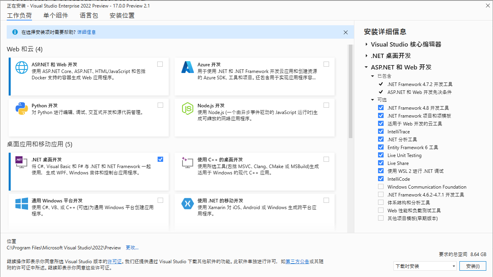
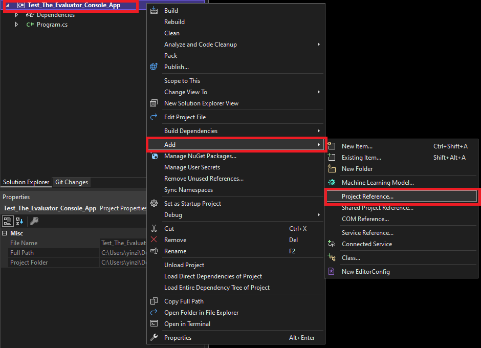
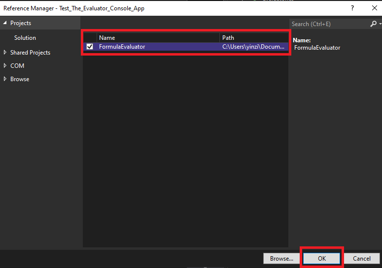
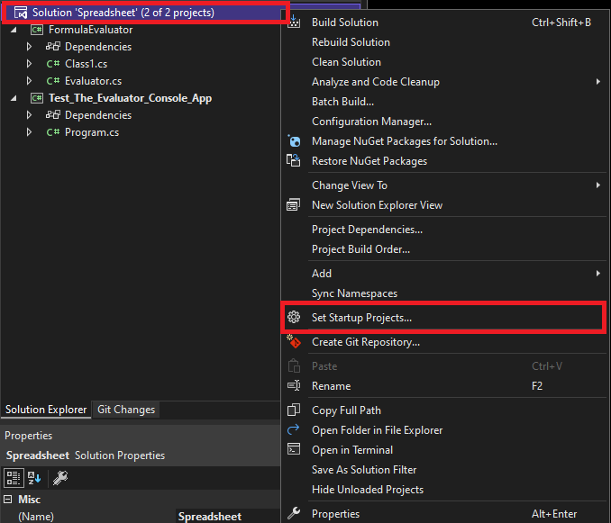
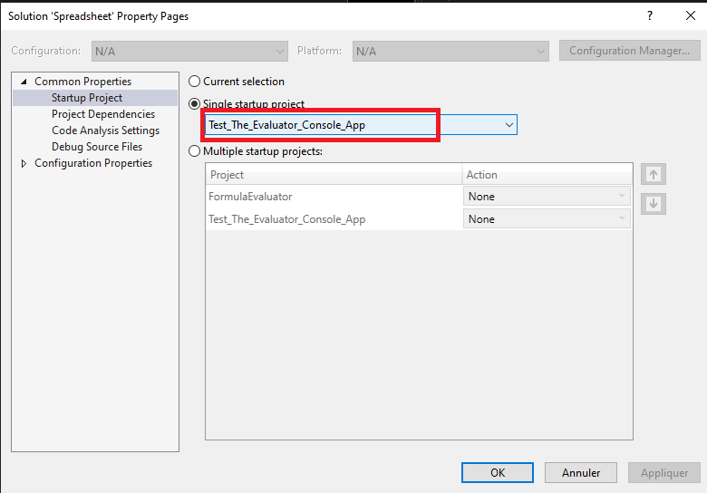

# 安装可以运行C#的Visual Studio

通过这个[微软官网链接](https://visualstudio.microsoft.com/zh-hans/vs/mac/preview/)下载Visual Studio 2022 for mac Preview安装程序。
 
 
下载完成后，打开安装程序，并选择安装所需的组件（勾选“.NET桌面开发”即可），然后点击安装。耗时较长，可以做点其他事。

# 配置Build环境

1. 一个solution、两个project

    1. 将 FormulaEvaluator 设置为 Test_The_Evaluator_Console_App 的 reference
     
     
    右键 Test_The_Evaluator_Console_App ， 进入选项 Add 然后进入 Project Reference

    勾选 FormulaEvaluator，然后点击 OK 

    2. 将 solution 的启动 project 设置为 Test_The_Evaluator_Console_App

    右键 solution ， 进入选项 Set Startup Projects 

    将启动项目设置为类型为 Console APP 的 Test_The_Evaluator_Console_App

    这样做的目的是在 build 整个 solution 后 **启动工程时**，可以正确地找到 Test 的 Main函数并开始程序。

    2. 
2. 
